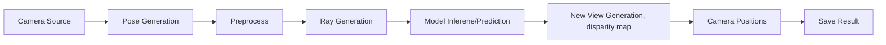

# Deployment


Once the model is trained using `Trainer`, it can be exported into various model format such as onnx, openvino. In order to deploy trained pytorch model, please follow this guideline

**Step-1: Export model**

Using command line:
```bash
nerf mode=export model="nerf_trained_exp_a.pt" resolution=800
```
Using python script:
```
from nerf import Exporter

model = Exporter(...)
model.export(resolution=800, format="onnx", ...)
```

Once the model is exported in desired format then `nerf` package is not needed anymore though it can be used as well in production.

**Step-2: Deploy model**

Exported model can be deployed in can be easily deployed in `onnx-runtime`. A sample inference server is provided in `examples/onnx_infer.py` . But it can also be deployed in other ways such as 

- Docker Containers
- Inference MicroServices
- Nvidia Triron Inference Server
- OpenVino Inference Server
- Pytorch Inference Server

**Deployment Proces:**



